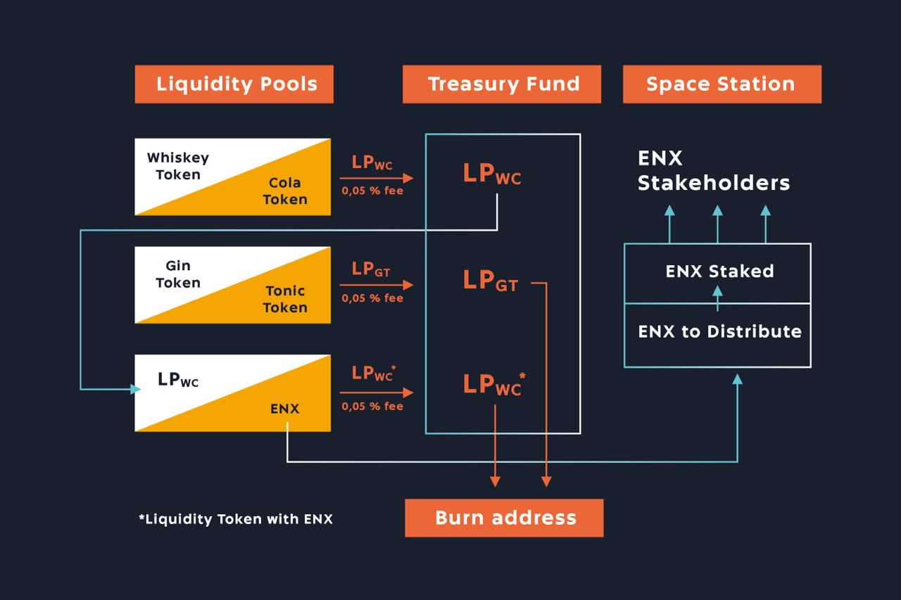

# Welcome to ENEX.SPACE

## Overview

**ENEX** is the first DeFi platform powered by [**Enecuum Network.**](https://enecuum.com/)\*\*\*\*

**Trade, earn, issue and raise at** [**ENEX.SPACE**](https://enex.space/) **with uncompromising security and extremely low fees.**

**ENEX.SPACE** is DeFi platform built on Enecuum blockchain. **ENEX.SPACE** functioning based on $ENX token. $ENX represents overall liquidity in **ENEX.SPACE** and can be used to gain profit from trading operations. From the user’s point of view **ENEX.SPACE** consists of liquidity pools, treasury and Space Station.

## Liquidity pools \(LP\)

Liquidity pool is trading pair with automatic market making \(AMM\) mechanism. Any user can create new liquidity pool of any two assets or add assets to any existing LP. As soon as liquidity pool created, corresponding liquidity pool token \(LP token\) is created automatically. When user adds liquidity \(both assets\) to LP, he receives corresponding LP token. Assets can be traded by adding one asset to pool and receiving another in exchange. Amount of received token is calculated by AMM formula automatically. After each trade **0.35%** of traded volume is collected as a fee. **0.30%** returns to pool as liquidity and **0.05%** moves to ENEX treasury in form of LP tokens. At any moment user can extract assets from liquidity pool by returning corresponding LP token to pool.

## Commander ENEX

Commander is entity which has full access to treasury. [**Treasury**](treasury-fund/treasury-fund.md) is filled up with fees from pool trades in form of LP tokens\(see [**Liquidity pools**](exchange-1/liquidity-pools.md) section\). Some of these tokens are traded to ENX via liquidity pools. Commander ENEX occasionally sells these LP tokens for ENX. Tokens which cannot be traded to ENX are sent to burn address. All exchanged ENX are sent to[ **Space Station**](space-station-pool.md) for distribution.

On picture above, there are three liquidity pools. Trading fees are gathered in treasury in form of LPs: 

* Whiskey/Cola with LPwc liquidity token, 
* Gin/Tonic with LPgt liquidity token,
*  LPwc/ENX with LPwc\* liquidity token. 

In time, treasury is filled up with LPwc, LPgt and LPwc\*. 

As long as there is traiding pair LPwc/ENX, LPwc tokens are traded to ENX, while LPgt and LPwc\* are burned.

## Space Station

Space station is a mechanism of distribution of certain amount of ENX over ENX shareholders. Any user can stake arbitrary amount of ENX. Occasionally, some ENX are moved to [**Space Station**](space-station-pool.md) \(see Commander ENEX section\) for distribution. Those ENXs are distributed proportionally among all shareholders.

For example, there are two shareholders A and B with shares of 10 and 40 ENX respectively. So, A share is 20% and B share is 80%. Let 60 ENX are sent to Station over some period of time. Then, shareholder A will be rewarded with 12 ENX \(20% of 60 ENX\), and shareholder B will be rewarded with 48 ENX \(80% of 60 ENX\).

## Key points

When you use traditional **Uniswap-like AMM DEXes**, you always make so called "approve" operation. If you confirm it by default, you allow all possible amount of approved token to be managed by the DEX smart contract. This is a serious security problem as it **breaks one of the main principles of a cryptocurrency** --- the owner and only the owner of assets should have full control over the assets. Architecture of Enecuum Network without approval functionality opposite to Ethereum based blockchains **make your pools secure and leave you full control over the funds**. 

_**To get more details go to:**_




**This Docs describe ENEX.SPACE V.1.0**


