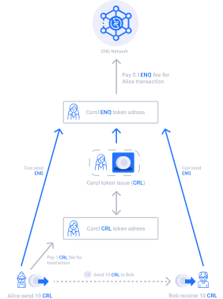

# 代币发布机ETM

### 什么是代币发布机ETM？

ETM是Enecuum代币发布机，提供友好且快速的界面，用于在Enecuum网络上创建代币。

**不可增发的代币**

不可重新发行-具有固定供应量的代币。发行代币后，将无法再释放额外的代币。

**可增发的代币**

可再发行-具有灵活供应的代币。代币发行后，可以通过发行或销毁代币来变更其供应量。

**可开采代币**

可开采 - 可以开采的代币。规定了一定数量进行即时发布（首次发行），其余部分则由用户使用安卓手机通过PoA算法进行挖掘。

**有关PoA挖掘的更多信息：**



**在Enecuum官方指南中阅读有关采矿机的更多信息：**

[https://guides.enecuum.com/enq/token-issue.html\#mining-slots](https://guides.enecuum.com/enq/token-issue.html#mining-slots)

**在发行可挖矿代币之前，请使用代币计算器进行试算：**

[https://pulse.enecuum.com/\#!/token-roi](https://pulse.enecuum.com/#!/token-roi)

**收费原则**

对于每笔交易（包括自定义代币），用户都需要支付交易费。当发送$ ENQ时，用户向Enecuum网络支付0.1 $ ENQ费​​用。发送自定义代币时，用户将费用支付给代币创建者。费用金额由该代币创建者设置。对于自定义代币交易，每次代币创建者需向Enecuum网络支付0.1 $ ENQ费用。

代币创建者还需要选择费用类型。费用可以是固定费用或按百分比收取。对于任何交易，固定费用均保持不变；按百分比收取则取决于交易金额。如果选择了百分比费用，创建者还可以选择最低收费。也就是，如果交易百分比费用太低，则用户将支付最低费用。

**举个实际例子：**

1. Carol创建了她的自定义代币$ CRL。她将交易费用类型设置为固定。她还将费用金额设置为1 CRL。Carol将费用通过 $ENQ支付到Enecuum Genesis地址以进行代币创建。
2. Alice向Bob发送10 $CRL。她向Carol支付了$ 1CRL的费用。Bob收到10 $CRL。
3. Carol为这笔交易向Enecuum Genesis地址支付了0.1 $ENQ。



### 相关链接:

**Enecuum区块链：**



## 

