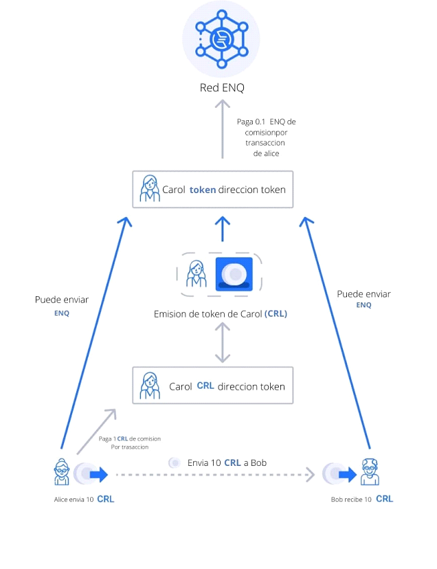

# Máquina de tokens \(ETM\)

### ¿Qué es ETM?

ETM es Enecuum Token Machine\(Maquiena de tokens\): una interfaz rápida y fácil de usar para crear tokens en la parte superior de la red de Enecuum.

**Tokens No Re-emitible**

Tokens con suministro fijo. Después del lanzamiento del token, no se pueden emitir monedas token adicionales.

**Tokens Re-emitibles**

Tokens con suministro flexible. Después del lanzamiento del token, su suministro se puede cambiar emitiendo o quemando monedas.

**Fichas minable**

Mineable: fichas que se pueden extraer. Parte del volumen se selecciona para su lanzamiento instantáneo \(premine\), y el resto lo extraen los usuarios mediante algoritmos de PoA que utilizan teléfonos móviles con Android.

**Más sobre la minería PoA:**



**Lea más sobre las tragamonedas de minería en las guías oficiales de Enecuum:**

[https://guides.enecuum.com/enq/token-issue.html\#mining-slots](https://guides.enecuum.com/enq/token-issue.html#mining-slots)

**Utilice la calculadora de tokens antes de emitir tokens extraíbles:**

[https://pulse.enecuum.com/\#!/token-roi](https://pulse.enecuum.com/#!/token-roi)

### Comisiones principales

Con cada transacción, incluidos los tokens personalizados, los usuarios deben pagar la tarifa de transacción. Al enviar $ ENQ, el usuario paga una tarifa de 0.1 $ ENQ a la red Enecuum. Al enviar tokens personalizados, el usuario paga la tarifa al creador del token. El monto de la tarifa lo establece el creador del token. Con cada transacción de token personalizado, el creador del token paga una tarifa de 0.1 $ ENQ a la red Enecuum.

El creador del token también elige el tipo de tarifa. La tarifa puede ser fija o porcentual. La tarifa fija permanece igual para cualquier transacción. La tarifa porcentual depende del monto de la transacción. Si se selecciona la tarifa porcentual, el creador también puede elegir la tarifa mínima. Luego, el usuario pagará la tarifa mínima si la tarifa porcentual de la transacción es demasiado baja.

**A continuación, se muestra un ejemplo de cómo funciona:**

1. Carol crea su token personalizado $ CRL. Establece el tipo de tarifa de transacción en fijo. También establece el monto de la tarifa en 1 $ CRL. Carol paga la tarifa en $ ENQ a la dirección de Enecuum Genesis por la creación del token.
2. Alice envía 10 $ CRL a Bob. Ella le paga 1 $ CRL a Carol. Bob recibe 10 $ CRL.
3. Carol paga una tarifa de 0.1 $ ENQ a la dirección de Enecuum Genesis por la transacción que envió Alice.



### Enlaces útiles:

**Enecuum blockchain explorer - tokens:**



## 

