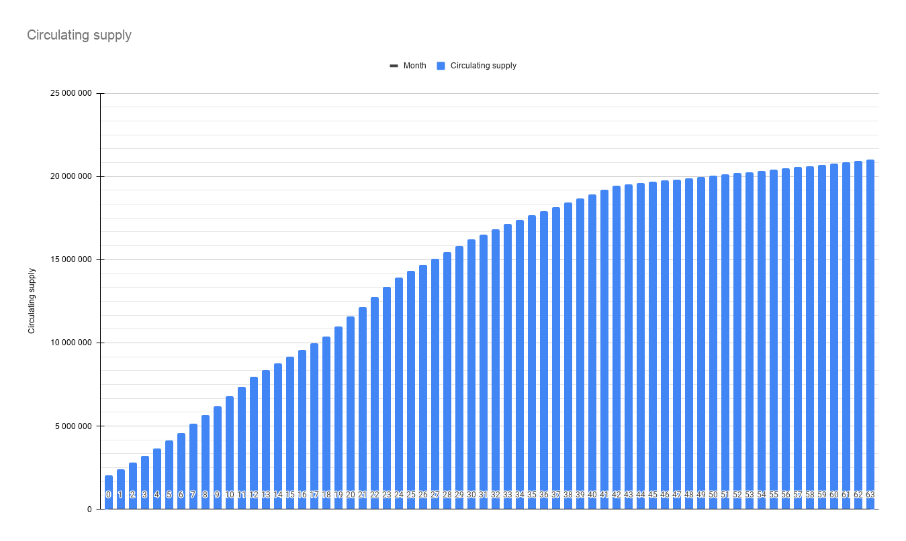
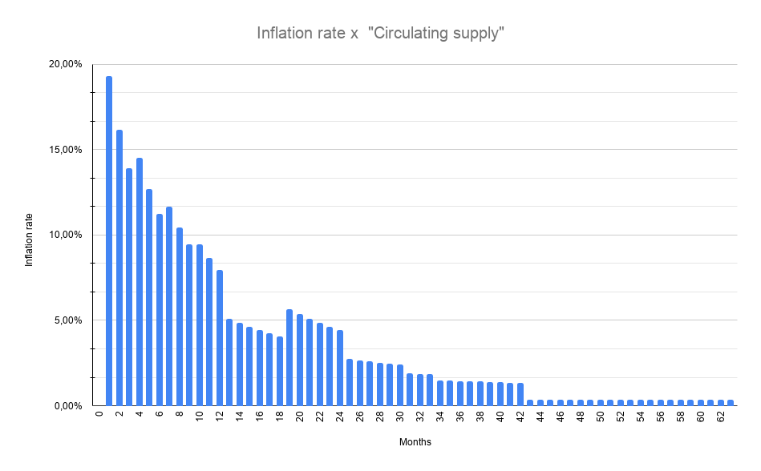

# Tokenomics

## ENX Token Dağıtımı 

ENX’in token modeline göre, **$ ENX** toplam arz, tek seferlik basımla 21 milyon olacak ve aşağıdaki dağıtıma sahip olacak:

**$ ENQ sahipleri için Topluluk Turu**

* Toplam arzın% 5'i \(1.050.000 $ ENX\) Enecuum topluluğuna her bir **ENX $** için **0.21 $** fiyatla sunulacak. İlk kilit açma, satın alma tutarının% 10'u ve önümüzdeki 12 ay boyunca aylık% 7,5 olacaktır. Topluluk satışı turuna katılmak için, sağlanacak olan adrese $ ENQ göndermelisiniz.
* Satış sırasında toplanan tüm $ ENQ jetonlarının% 100'ü üç ay boyunca kilitlenecek ve ardından dokuz aylık kilitlenme dönemi ile **$ ENX** \(ENQ / ENX likidite havuzu\) ile çifte **ENEX.SPACE**'e eklenecektir.
* Bir $ ENQ adresi başına maksimum tutar 25.000 $ ENQ'dur.
* Bu tur için döviz kuru **1 ENX = 2,1 ENQ** olacaktır, **1 ENQ = 0,1 $ 'a göre.**
* **1.050.000 $ ENX** değişim tutarı **2.205.000 $ ENQ** için teklif edilecektir.
* Abone olunan $ ENQ orantılı olarak ENQ sahiplerine iade edilir.

**Özel Tur**

* Toplam arzın% 21'i \(4,410,000 $ ENX\), bir **ENX $ için 0,33 $** fiyatla stratejik ortaklara sunulacak.
* İlk kilit açma, satın alma tutarının% 15'ini ve önümüzdeki 12 ay için aylık% 7.08'ini temsil edecek.
* Özel tur ETH / USDT'de yapılacak. Minimum lot 30.000 USDT eşdeğeri. Maksimum 150.000 USDT'dir.

**Halka Açık Tur**

* Toplam arzın% 2'si \(420,000 $ ENX\), bir **ENX $ başına 0,55 $** fiyatla halka arz edilecek
* Halka açık tur ETH / USDT'de yapılacak.

**DEX havuzları**

* Toplam arzın% 5'i \(1.050.000 $ ENX\) ve halka açık tur fiyatına karşılık gelen ETH miktarı 50 / 50'ye bölünecek ve Uniswap'ta ENX / ETH ve **ENEX**'te eENX / eETH havuzunda kilitlenecek.
* Kilit süresi bir yıldır.

**Pazarlama**

* Toplam arzın% 6'sı \(1.260.000 $ ENX\) 9 ay süreyle kilitli kalacak.
* Kilit açma 9 ay sonra başlayacak ve önümüzdeki 24 ay için aylık% 4,17'yi temsil edecek. 

**Gelecekteki Kaynak Yaratma**

* Toplam arzın% 11'i \(2.310.000 $ ENX\) bir yıllığına kilitlenecek.
* Kilit açma işlemi bir yıl sonra başlayacak ve önümüzdeki 12 ay için aylık% 8.33'ü temsil edecek.

#### Commander ENEX Hazine Fonu

* Toplam arzın% 21'i - \(4.410.000 $ ENX\) 3 aylığına kilitli kalacak.
* [Space Harvest Farm](yield-farming-space-harvest-farm.md) için $ ENX'in kilidini açma ve stake etme 3 ay sonra başlayacak ve önümüzdeki 60 ay boyunca aylık% 1.67'yi temsil edecek.

**Danışmanlar ve stratejik ortaklar**

* Toplam arzın% 8'i \(1.680.000 $ ENX\) 6 aylığına kilitli kalacak. 
* Kilit açma 6 ay sonra başlayacak ve önümüzdeki 24 ay için aylık% 4,17'yi temsil edecek.

**Takım**

* Toplam arzın% 21'i \(4.410.000 $ ENX\) 18 aylığına kilitli kalacak.
* Kilit açma 18 ay sonra başlayacak ve önümüzdeki 24 ay için aylık% 4,17'yi temsil edecek.

## TGE Sonrası Dolaşan Arz

<table>
  <thead>
    <tr>
      <th style="text-align:left"></th>
      <th style="text-align:left">
        
Fiyat

        
ENX ba&#x15F;&#x131;na

      </th>
      <th style="text-align:right">
        
Kilitli de&#x11F;il

        
0. g&#xFC;nde ENX

      </th>
      <th style="text-align:center">TS%</th>
      <th style="text-align:right">USDT De&#x11F;eri</th>
    </tr>
  </thead>
  <tbody>
    <tr>
      <td style="text-align:left">$ ENQ sahipleri i&#xE7;in Topluluk Turu</td>
      <td style="text-align:left">$0.21</td>
      <td style="text-align:right">105,000.00</td>
      <td style="text-align:center">0.5%</td>
      <td style="text-align:right"></td>
    </tr>
    <tr>
      <td style="text-align:left">&#xD6;zel Tur</td>
      <td style="text-align:left">$0.33</td>
      <td style="text-align:right">661,500.00</td>
      <td style="text-align:center">3.15%</td>
      <td style="text-align:right"></td>
    </tr>
    <tr>
      <td style="text-align:left">Halka A&#xE7;&#x131;k Tur</td>
      <td style="text-align:left">$0.55</td>
      <td style="text-align:right">420,000.00</td>
      <td style="text-align:center">2.00%</td>
      <td style="text-align:right"></td>
    </tr>
    <tr>
      <td style="text-align:left"><b>3 turdan itibaren toplam</b>
      </td>
      <td style="text-align:left"><b> </b>
      </td>
      <td style="text-align:right"><b>1,186,500.00</b>
      </td>
      <td style="text-align:center"><b>5.65%</b>
      </td>
      <td style="text-align:right">&lt;b&gt;&lt;/b&gt;</td>
    </tr>
    <tr>
      <td style="text-align:left"><b>DEX, Commander&apos;dan likidite topluyor</b>
      </td>
      <td style="text-align:left"><b>$0.55</b>
      </td>
      <td style="text-align:right"><b>1,050,000.00</b>
      </td>
      <td style="text-align:center"><b>5.00%</b>
      </td>
      <td style="text-align:right"><b>$577,500.00</b>
      </td>
    </tr>
  </tbody>
</table>

## **ENX** Kilit Açma Programı 

**İşte 63 ay boyunca her ay için bir kilit açma programı.**

## Aya Göre Enflasyon Oranı

**İşte 63 aylık bir enflasyona karşı yeni arz diyagramı.**

## Tahsis Tablosu 

|  | Tahsis | $ENX |
| :--- | ---: | ---: |
| ENQ sahipleri için Topluluk Turu | 5.00% | 1,050,000.00 $ENX |
| Özel tur | 21.00% | 4,410,000.00 $ENX |
| Halka açık tur | 2.00% | 420,000.00  $ENX |
| DEX havuzları | 5.00% | 1,050,000.00 $ENX |
| Pazarlama | 6.00% | 1,260,000.00  $ENX |
| Likidite havuzları için Gelecekteki Kaynak Yaratma | 11.00% | 2,310,000.00 $ENX |
| Commander ENEX Hazine Fonu | 21.00% | 4,410,000.00 $ENX |
| Danışmanlar ve stratejik ortaklar | 8.00% | 1,680,000.00 $ENX |
| Takım | 21.00% | 4,410,000.00 $ENX |
| **Toplam** | **100.00%** | **21,000,000.00 $ENX** |

## Ek 1.

### Topluluk turu kısa açıklaması:

* Tahsis:  **1,050,000 $ENX**
* Döviz kuru:  **1 ENX = 2.1 ENQ**
* Açılış turu:  **16 March, 5 pm UTC**
* Tur kapanışı: **19 March, 9 pm UTC**
* Maksimum bilet: **25,000.00 ENQ for one wallet**
* ENX dağılımı: **tüm katılımcılar arasında orantılı**
* Abone olunan ENQ'nun iadesi: **20 Mart 2021**
* ENX kilitlenme süresi: **0 günde% 10, sonraki 12 ay için aylık% 7,5.**

