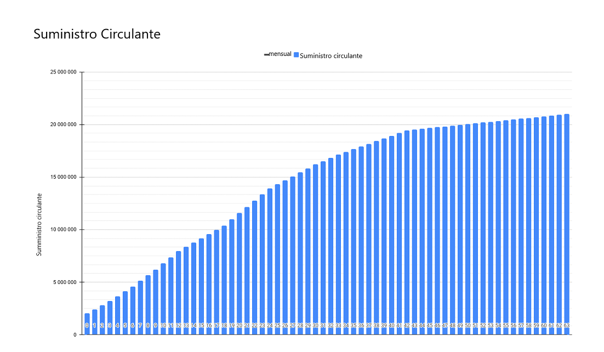
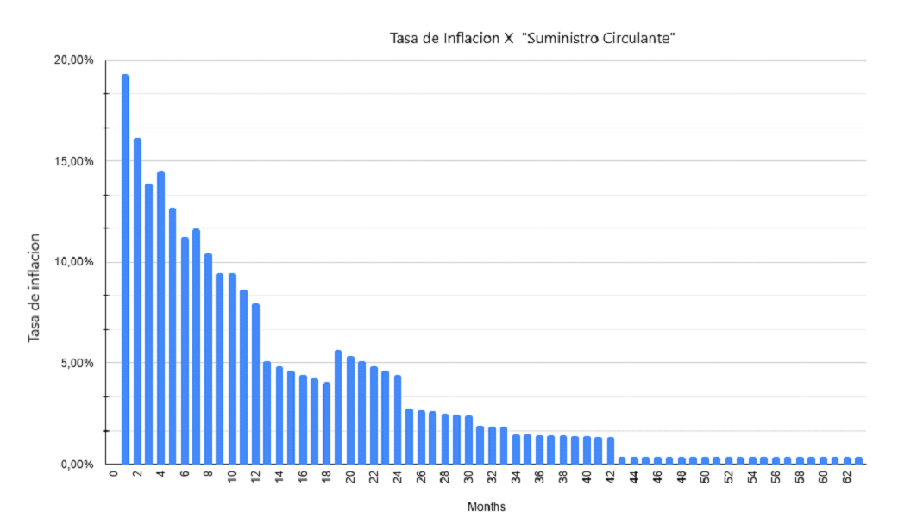

# Tokenomics

## Distribución de tokens ENX 

Según el modelo de token de ENX, el suministro total de **$ ENX** será de 21 millones con acuñación única y tendrá la siguiente distribución:

#### Ronda de la comunidad para los poseedores de $ ENQ

* El 5% del suministro total \(1.050.000 $ ENX\) se ofrecerá a la comunidad de Enecuum, con un precio de **$ 0.21 por un $ ENX** . El desbloqueo inicial será del 10% del importe de la compra y del 7,5% mensual durante los próximos 12 meses. Para unirse a la ronda de venta comunitaria, debe enviar $ ENQ a la dirección que se le proporcionará.
* El 100% de todos los tokens $ ENQ recolectados durante la venta se bloquearán durante tres meses y luego se agregarán a **ENEX.SPACE** al par con **$ ENX** \(grupo de liquidez ENQ / ENX\) con un período de bloqueo de nueve meses.
* La cantidad máxima por una dirección de $ ENQ es de 25.000 $ ENQ.
* El tipo de cambio para esta ronda será **1 ENX = 2.1 ENQ** , basado en **1 ENQ = $ 0.1**.
* Se ofrecerá un canje de **1.050.000 $ ENX por 2.205.000 $ ENQ**
* Los $ ENQ sobreuscritos se devolverían proporcionalmente a los tenedores de ENQ.

**Ronda privada**

* El 21% del suministro total \(4,410,000 $ ENX\) se ofrecerá a socios estratégicos con un precio de **$ 0.33 por un $ ENX**
* El desbloqueo inicial representará el 15% del monto de la compra y el 7.08% mensual durante los próximos 12 meses.
* La ronda privada se llevará a cabo en ETH / USDT. El lote mínimo es equivalente a 30k USDT. El máximo es 150k USDT.

**Ronda pública**

* ⦁ El 2% del suministro total \(420.000 $ ENX\) se ofrecerá al público con un precio de **$ 0,55 por un $ ENX**
* La ronda pública se llevará a cabo en ETH / USDT.

**Piscinas DEX**

* El 5% del suministro total \(1,050,000 $ ENX\) y la cantidad correspondiente de ETH al precio de ronda pública se dividirá 50/50 y se bloqueará en el grupo ENX / ETH en Uniswap y eENX / eETH en **ENEX.SPACE**
* El plazo de bloqueo es de un año.

**Márketing**

* El 6% del suministro total \(1,260,000 $ ENX\) se bloqueará durante 9 meses. 
* El desbloqueo comenzará después de 9 meses y representará un 4.17% mensual durante los próximos 24 meses. 

**Recaudación de fondos en el futuro**

* El 11% del suministro total \(2,310,000 $ ENX\) se bloqueará durante un año.
* ⦁ El desbloqueo comenzará después de un año y representará un 8.33% mensual durante los próximos 12 meses.

**Fondo de Tesorería Comandante ENEX**

* ⦁ 21% del suministro total - \(4,410,000 $ ENX\) se bloqueará durante 3 meses.
* ⦁ Desbloquear y apostar $ ENX para [**Space Harvest Farm**](yield-farming-space-harvest-farm.md)  comenzará después de 3 meses y representará 1.67% mensual durante los próximos 60 meses.

**Asesores y socios estratégicos**

* El 8% del suministro total \(1,680,000 $ ENX\) se bloqueará durante 6 meses. 
* El desbloqueo comenzará a los 6 meses y representará un 4,17% mensual durante los próximos 24 meses.

#### Equipo 

* El 21% del suministro total \(4,410,000 $ ENX\) se bloqueará durante 18 meses.
* El desbloqueo comenzará a los 18 meses y representará un 4,17% mensual durante los próximos 24 meses.

## Suministro circulante después de TGE

<table>
  <thead>
    <tr>
      <th style="text-align:left"></th>
      <th style="text-align:left">Precio por ENX</th>
      <th style="text-align:right">
        
Desbloqueado

        
ENX en el d&#xED;a 0

      </th>
      <th style="text-align:center">TS%</th>
      <th style="text-align:right">Valor USDT</th>
    </tr>
  </thead>
  <tbody>
    <tr>
      <td style="text-align:left">Ronda de la comunidad para los poseedores de $ ENQ</td>
      <td style="text-align:left">$0.21</td>
      <td style="text-align:right">105,000.00</td>
      <td style="text-align:center">0.5%</td>
      <td style="text-align:right"></td>
    </tr>
    <tr>
      <td style="text-align:left">Ronda privada</td>
      <td style="text-align:left">$0.33</td>
      <td style="text-align:right">661,500.00</td>
      <td style="text-align:center">3.15%</td>
      <td style="text-align:right"></td>
    </tr>
    <tr>
      <td style="text-align:left">Ronda p&#xFA;blica</td>
      <td style="text-align:left">$0.55</td>
      <td style="text-align:right">420,000.00</td>
      <td style="text-align:center">2.00%</td>
      <td style="text-align:right"></td>
    </tr>
    <tr>
      <td style="text-align:left"><b>Total de 3 rondas</b>
      </td>
      <td style="text-align:left"><b> </b>
      </td>
      <td style="text-align:right"><b>1,186,500.00</b>
      </td>
      <td style="text-align:center"><b>5.65%</b>
      </td>
      <td style="text-align:right">&lt;b&gt;&lt;/b&gt;</td>
    </tr>
    <tr>
      <td style="text-align:left"><b>DEX agrupa la liquidez de Commander</b>
      </td>
      <td style="text-align:left"><b>$0.55</b>
      </td>
      <td style="text-align:right"><b>1,050,000.00</b>
      </td>
      <td style="text-align:center"><b>5.00%</b>
      </td>
      <td style="text-align:right"><b>$577,500.00</b>
      </td>
    </tr>
  </tbody>
</table>

## Horario de desbloqueo de ENX 

**Aquí hay un calendario de desbloqueo para cada mes durante 63 meses.**

## Tasa de inflación por mes

**Aquí hay un diagrama de inflación frente a nueva oferta durante 63 meses.**

## Tabla de asignación 

|  | Asignación | $ENX |
| :--- | ---: | ---: |
| Ronda comunitaria para titulares de ENQ | 5.00% | 1,050,000.00 $ENX |
| Ronda privada  | 21.00% | 4,410,000.00 $ENX |
| Ronda pública | 2.00% | 420,000.00  $ENX |
| Piscinas DEX | 5.00% | 1,050,000.00 $ENX |
| Márketing | 6.00% | 1,260,000.00  $ENX |
| Recaudación de fondos futura para fondos comunes de liquidez | 11.00% | 2,310,000.00 $ENX |
| Fondo de Tesorería Comandante ENEX | 21.00% | 4,410,000.00 $ENX |
| Asesores y socios estratégicos | 8.00% | 1,680,000.00 $ENX |
| Equipo | 21.00% | 4,410,000.00 $ENX |
| **Total** | **100.00%** | **21,000,000.00 $ENX** |

## Apéndice 1.

### Breve explicación de la ronda comunitaria:

* ⦁ Asignación: **1,050,000 $ENX**
* ⦁ Tipo de cambio: **1 ENX = 2.1 ENQ**
* ⦁ Ronda de apertura: **16 de marzo, 5 pm UTC**
* ⦁ Cierre de la ronda: **19 de marzo, 9 pm UTC**
* ⦁ Boleto máximo: **25,000.00 ENQ por una billetera**
* ⦁ Distribución ENX: **proporcional entre todos los participantes**
* ⦁ Devolución de ENQ con exceso de suscripción: **20 de marzo de 2021**
* ⦁ Período de bloqueo de ENX: **10% al día 0, 7.5% mensual durante los próximos 12 meses.**

